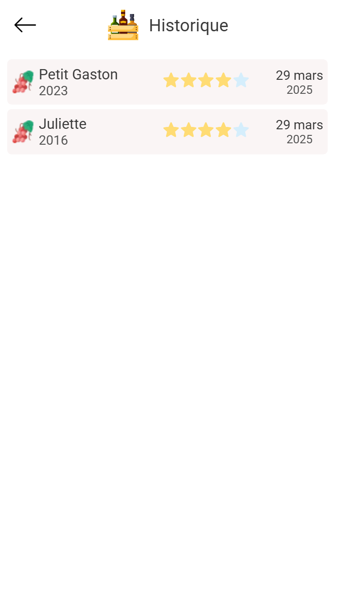
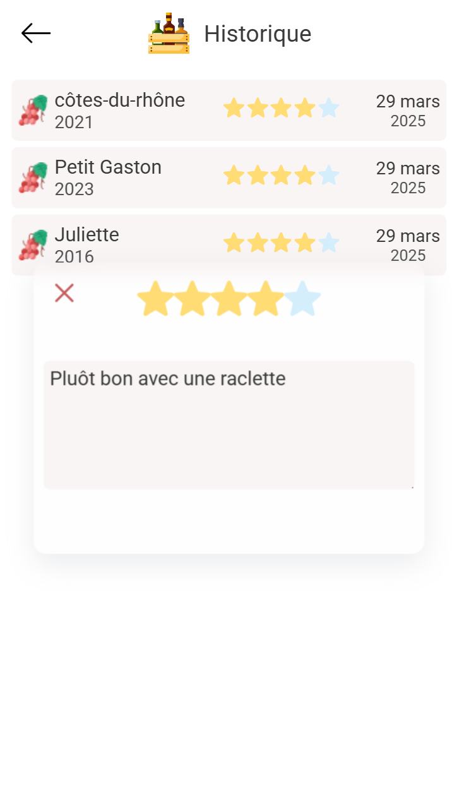

# My cellar

A mobile application designed to help you manage your wine cellar efficiently. With this app, you can organize, review, and keep track of your wine collection. [Screenshot of the app](#screenshot)

## Features

### Version 1.0
The first release is focused on **Android** with the following functionalities:
- **Authentication**: Login with Google.
- **Language Support**: Available in English and French.
- **Cellar Management**:
    - Create, edit, and delete your wine cellar(s).
- **Bottle Management**:
    - Add, edit, delete (mark as drunk) bottles in your cellar.
- **Review System**:
    - Add and edit reviews for each bottle.
    - Rate bottles (1 to 5 stars) and provide written reviews, e.g., *"Pretty good, pairs well with raclette."*
- **History Tracking**:
    - View the drinking history of bottles for each cellar.

## Architecture

### Frontend
- Built with **Ionic Framework** and **Vue.js**.

In development
```bash 
npm install -g @ionic/cli
ionic serve
```

### Backend
- Built with **Flask** (Python).
- MySQL database for data persistence.
- The backend and database are containerized with **Docker** for portability and ease of deployment.

In development
```bash 
docker-compose -f docker-compose-dev.yml up
```

## Branch Management

The project follows a Git-based branching strategy:
- **`main`**: Used for development.
- **`production`**: Used for production-ready releases.

### GitHub Actions
1. **CI Pipeline** (`CI pipeline.yml`):
    - Runs on every push to the `main` branch.
    - Updates the Docker image (`:dev`) for development.

2. **Deployment Workflow** (`deploy-backend.yml`):
    - Triggers on pull requests to the `production` branch.
    - Updates the production Docker image (`:latest`) by building from the `:dev` image.


## Future Roadmap
Planned features for upcoming releases:
- Deployement Android
  - add certificat openSSL (HTTPS)
  - CI for deploy on the Playstore
- Web version of the app
  - responsive for all devices
- IOS
- Follow friends and see cellar of other user
- AI who can give advise to the user
  - chatbot
  - model trained

## Screenshot
[//]: # (![img.png]&#40;images/login.png&#41;)

[//]: # (![img.png]&#40;images/yourcellar.png&#41;)

[//]: # (![img.png]&#40;images/cellar.png&#41;)

[//]: # (![img.png]&#40;images/bottledetails.png&#41;)

[//]: # (![img.png]&#40;images/history.png&#41;)

[//]: # (![img.png]&#40;images/editreviewnInHisoty.png&#41;)

<div style="display: flex; flex-wrap: wrap; gap: 10px;">

  
  

  
  

  
  

</div>

> _By **Vladou** and **Gastoune**_ 🤪
